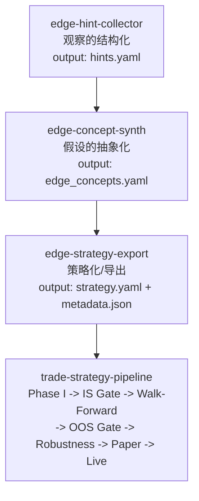
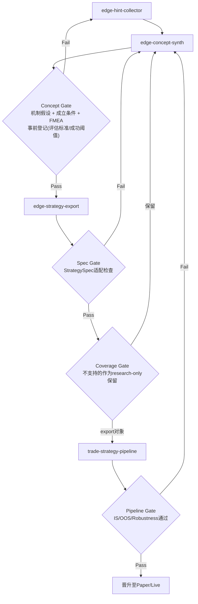
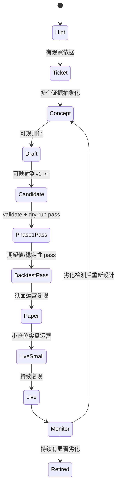
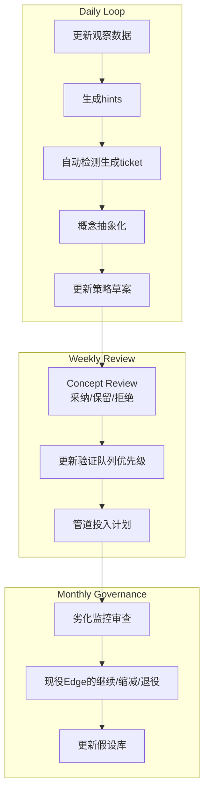

# Edge制度化流程

将日常"灵感"不停留在个人备忘层面，而是提升为可复现的策略资产的标准流程。

## 目的

- 将观察 -> 抽象化 -> 策略化 -> 管道验证进行分工
- 在各阶段定义"晋级门控"，确保质量统一
- 将Edge的生成和劣化监控放在同一运营体系中

## 1. 3技能构成 + 管道连接

### 1-1. 主线

### 1-2. 退回循环（门控运营）

### 1-3. 实现映射（当前仓库）

| 逻辑技能名 | 当前实现 |
|---|---|
| edge-hint-collector | `skills/edge-hint-extractor` |
| edge-concept-synth | `skills/edge-concept-synthesizer` |
| edge-strategy-export | `skills/edge-strategy-designer` + `skills/edge-candidate-agent` (`export_candidate.py` / `validate_candidate.py`) |

## 2. Edge的晋级状态（升学模型）

## 3. 日/周运营节奏

## 4. 晋级门控的最低要求

| 门控 | 最低要求 | 不合格条件 |
|---|---|---|
| Concept Gate | thesis + invalidation_signals 已明确 | 假设仅为观察的改述 |
| Draft Gate | entry/exit/risk/cost 已定义 | 未考虑成本、不可实现条件 |
| Pipeline Gate | 满足 `edge-finder-candidate/v1` 契约 | schema违规、dry-run失败 |
| Promotion Gate | OOS中复现且可进行劣化监控 | 仅特定期间有效、容量不足 |

## 5. 首先关注的要点

1. `edge_concepts.yaml` 的 `abstraction.thesis` 和 `invalidation_signals`
2. `strategy_drafts/*.yaml` 的 `risk` 和 `validation_plan`
3. `validate_candidate.py` 结果（I/F适配）
4. 管道结果的可复现性（期间分割/regime分割）
