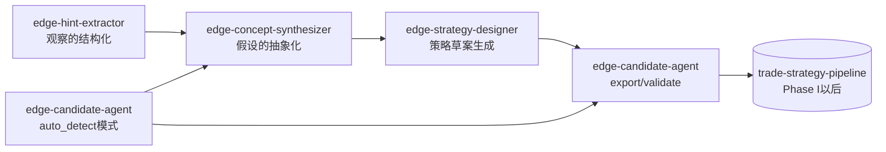
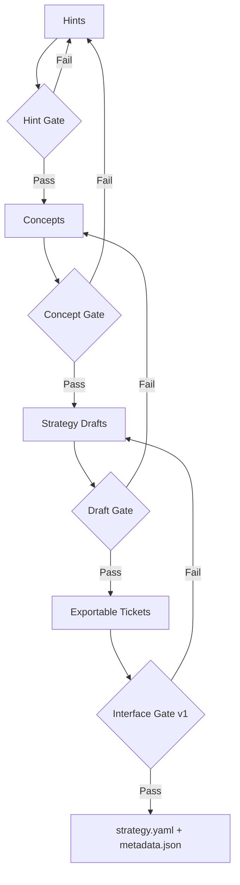

# 美股Edge创出代理设计（实现反映版）

## 0. 目的
从日常观察数据中，
**「持续生成可复现的Edge假设」，稳定供给到策略素材（strategy draft）**
的运营系统，依照现有4技能实现进行重新设计。

- 目标市场：美股（以做多为主）
- 主要时间跨度：数日到数周（研究主题可达60个交易日）
- 本设计的目标：
  1) 将观察结构化为 `hints.yaml`
  2) 将工单群抽象化为 `edge_concepts.yaml`
  3) 将概念策略化为 `strategy_drafts/*.yaml`
  4) 使可export的方案能晋升到 `ticket -> strategy.yaml + metadata.json`

> 旧版 `docs/edge_candidate_agent_design.md` 是构想阶段的单一代理前提。
> 本文是对应已实现的分割架构（4技能）的运营设计。

---

## 1. 范围
### 1.1 In Scope
- 从日常EOD观察生成Edge假设
- 假设的抽象化（机制假设 + 失效信号）
- 策略草案化（多种变体）
- 转换为 `edge-finder-candidate/v1` 兼容候选的准备

### 1.2 Out of Scope
- 生产环境执行（下单/成交管理）
- 完全自动的采纳决策（最终采纳保留人工审查）
- v1未支持信号的自动strategy export（作为research-only保持）

---

## 2. 设计原则
1. 不将观察与策略实现直接连接（必须有抽象化层）
2. 保持"可解释性"（`thesis` / `invalidation_signals` 为必填）
3. 明确分离export可行性（`export_ready_v1` 与 `research_only`）
4. 以市场环境依赖为前提（`regime` 在全阶段保持）
5. 日度运转、周度筛选、月度劣化监控

---

## 3. 系统全貌（4技能分割）



- 主线（推荐）：`Hint -> Concept -> Draft -> Export/Validate`
- 捷径（辅助）：`auto_detect_candidates.py` 自动生成工单，流入概念化

---

## 4. 各技能的职责和I/O

| 技能 | 主要职责 | 主要输入 | 主要输出 |
|---|---|---|---|
| `edge-hint-extractor` | 将观察数据转化为提示 | `market_summary.json`, `anomalies.json`, `news_reactions.*`(可选) | `hints.yaml` |
| `edge-concept-synthesizer` | 将工单群抽象化为概念集群 | `tickets/**/*.yaml`, `hints.yaml`(可选) | `edge_concepts.yaml` |
| `edge-strategy-designer` | 将概念转换为策略草案 | `edge_concepts.yaml` | `strategy_drafts/*.yaml`, `run_manifest.json`, `exportable_tickets/*.yaml`(可选) |
| `edge-candidate-agent` | 检测/工单化/export/契约验证 | `ohlcv.parquet`, `hints.yaml`(可选), `ticket.yaml` | `daily_report.md`, `tickets/*`, `strategies/<id>/strategy.yaml`, `metadata.json` |

---

## 5. 数据契约（基于当前实现）

### 5.1 Hint 契约 (`hints.yaml`)
最小必填为 `hints: []`。各 hint 推荐包含以下字段：

- `title`
- `observation`
- `preferred_entry_family`（可选，`pivot_breakout` / `gap_up_continuation`）
- `symbols`（可选）
- `regime_bias`（可选）
- `mechanism_tag`（可选）

### 5.2 Concept 契约 (`edge_concepts.yaml`)
集群键在实现上为 `hypothesis_type x mechanism_tag x regime`。

必填运营项目：
- `abstraction.thesis`
- `abstraction.invalidation_signals`
- `strategy_design.recommended_entry_family`
- `strategy_design.export_ready_v1`

### 5.3 Strategy Draft 契约 (`strategy_drafts/*.yaml`)
- `variant`: `core` / `conservative` / `research_probe`
- `entry_family`: 可export则为 `pivot_breakout` or `gap_up_continuation`，不支持的为 `research_only`
- `risk_profile`: 用 `conservative|balanced|aggressive` 调整风险
- 所有draft必须附带 `validation_plan`

### 5.4 Export Ticket 契约（candidate-agent投入用）
- 必填：`id`, `hypothesis_type`, `entry_family`
- `entry_family` 在v1中 **仅2种**
  - `pivot_breakout`
  - `gap_up_continuation`

### 5.5 Pipeline IF v1 契约（strategy.yaml）
遵循 `candidate_contract.py`。特别是以下为门控条件：

- required top keys: `id,name,universe,signals,risk,cost_model,validation,promotion_gates`
- Phase I约束：
  - `validation.method == full_sample`
  - `validation.oos_ratio` 未设置 or `null`
- 按入场方式的必填块：
  - `pivot_breakout -> vcp_detection`
  - `gap_up_continuation -> gap_up_detection`

---

## 6. 处理流程详细

### 6.1 Stage A: Hint Extraction（观察的结构化）
实现：`skills/edge-hint-extractor/scripts/build_hints.py`

输入来源：
- 市场摘要（可选）
- 异常检测（可选）
- 新闻反应（可选）
- LLM辅助（可选，`--llm-ideas-cmd`）

逻辑要点：
- regime推定（`RiskOn/RiskOff/Neutral`）
- 用规则将anomaly/news转化为hint
- 接收LLM hint并进行schema规范化
- 去重后用 `max_total_hints` 限制

期望成果：
- 每日生成下游可复用的观察上下文

### 6.2 Stage B: Concept Synthesis（假设的抽象化）
实现：`skills/edge-concept-synthesizer/scripts/synthesize_edge_concepts.py`

逻辑要点：
- 将ticket集群化（`hypothesis_type/mechanism/regime`）
- 创建support统计（`ticket_count`, `avg_priority_score`, symbol分布）
- 明确 `thesis` / `invalidation_signals`
- 从entry family分布决定 `recommended_entry_family`
- 将v1 export可行性作为 `export_ready_v1` 明确标示

期望成果：
- 为避免过拟合的"概念单位审查"打下基础

### 6.3 Stage C: Strategy Design（策略素材化）
实现：`skills/edge-strategy-designer/scripts/design_strategy_drafts.py`

逻辑要点：
- 可export的概念生成 `core + conservative`
- 不可export的概念生成 `research_probe`
- 用risk profile调整 `risk_per_trade`, `max_positions`
- 可选输出 `exportable_tickets/*.yaml`

期望成果：
- 从概念供给多方案的可验证策略素材

### 6.4 Stage D: Candidate Agent（检测/导出/验证）
实现：
- 检测: `auto_detect_candidates.py`
- export: `export_candidate.py`
- validate: `validate_candidate.py`

模式1: Auto-detect（观察起点）
- 从OHLCV创建特征量、regime判定、anomaly检测
- 分离输出可export候选（breakout/gap）和research-only候选（panic_reversal等）

模式2: Export/Validate（设计起点）
- 将 `exportable_tickets` 转换为 `strategy.yaml + metadata.json`
- `edge-finder-candidate/v1` 契约验证
- 可选通过 `--pipeline-root` 联动 `uv run` 进行schema/stage验证

---

## 7. 候选类型的处理方针（v1前提）

### 7.1 Export对象（可即时策略化）
- `breakout` -> `pivot_breakout`
- `earnings_drift` -> `gap_up_continuation`

### 7.2 Research-only（作为概念资产积累）
- `panic_reversal`
- `regime_shift`
- `sector_x_stock`
- `calendar_anomaly`
- `news_reaction`
- `futures_trigger`

> 研究候选不丢弃。
> 通过 `edge_concepts.yaml` 和 `strategy_drafts(research_probe)` 维持，在I/F扩展时重新晋升。

---

## 8. 晋级门控（运营质量）



### 8.1 Gate定义
- Hint Gate
  - 输入缺失或重复未导致提示质量劣化
- Concept Gate
  - `thesis` 和 `invalidation_signals` 已明确
  - support达到最低阈值以上（`--min-ticket-support`）
- Draft Gate
  - `entry/exit/risk/validation_plan` 已填写
- Interface Gate
  - 通过 `validate_ticket_payload` 和 `validate_interface_contract`

---

## 9. 日度编排规范

### 9.1 标准流程（推荐）
1. `edge-candidate-agent` auto detect更新 `market_summary/anomalies/tickets`
2. `edge-hint-extractor` 更新 `hints.yaml`（规则 + 必要时LLM）
3. `edge-concept-synthesizer` 创建 `edge_concepts.yaml`
4. `edge-strategy-designer` 创建 `strategy_drafts` 和 `exportable_tickets`
5. `edge-candidate-agent` export/validate通过前置门控

### 9.2 代表命令
```bash
# 1) detector
python3 skills/edge-candidate-agent/scripts/auto_detect_candidates.py \
  --ohlcv data/us_ohlcv.parquet \
  --output-dir reports/edge_candidate_auto \
  --top-n 12 --top-research-n 10

# 2) hints
python3 skills/edge-hint-extractor/scripts/build_hints.py \
  --market-summary reports/edge_candidate_auto/market_summary.json \
  --anomalies reports/edge_candidate_auto/anomalies.json \
  --output reports/edge_hints/hints.yaml

# 3) concepts
python3 skills/edge-concept-synthesizer/scripts/synthesize_edge_concepts.py \
  --tickets-dir reports/edge_candidate_auto/tickets \
  --hints reports/edge_hints/hints.yaml \
  --output reports/edge_concepts/edge_concepts.yaml \
  --min-ticket-support 2

# 4) drafts
python3 skills/edge-strategy-designer/scripts/design_strategy_drafts.py \
  --concepts reports/edge_concepts/edge_concepts.yaml \
  --output-dir reports/edge_strategy_drafts \
  --exportable-tickets-dir reports/edge_strategy_drafts/exportable_tickets \
  --risk-profile balanced

# 5) export/validate
python3 skills/edge-candidate-agent/scripts/export_candidate.py \
  --ticket reports/edge_strategy_drafts/exportable_tickets/<ticket>.yaml \
  --strategies-dir /path/to/trade-strategy-pipeline/strategies

python3 skills/edge-candidate-agent/scripts/validate_candidate.py \
  --strategy /path/to/trade-strategy-pipeline/strategies/<id>/strategy.yaml
```

---

## 10. 评分与优先级运营

### 10.1 实现层面的优先级
- detector用 `priority_score`（0-100）对候选排名
- hint匹配加分（symbol匹配强加分）
- ATR过大时扣分

### 10.2 运营层面的优先级轴
- `priority_score`（效果强度）
- `support.ticket_count`（复现频率）
- `export_ready_v1`（即时可验证性）
- 与 `regime` 的匹配（当前局面适配）

---

## 11. 周度/月度运营

### 11.1 Weekly Review
- `edge_concepts.yaml` 采纳/保留/拒绝
- 将 `strategy_drafts` 的优选方案放入验证队列
- 重新排列research-only主题的优先级

### 11.2 Monthly Governance
- export候选的通过率（Draft -> Interface）
- 各概念的失效信号触发频率
- 按regime的候选质量变化

---

## 12. 错误处理与降级
- 可选输入不足时继续处理，记录到 `skipped_modules`
  - `news_reaction(no_input)`
  - `futures_trigger(no_input)`
- 即使没有pipeline联动也可执行到interface验证
- LLM联动失败时仅用rule-based hints继续

---

## 13. 目录标准方案

```text
reports/
  edge_candidate_auto/
    market_summary.json
    anomalies.json
    watchlist.csv
    daily_report.md
    tickets/
      exportable/*.yaml
      research_only/*.yaml
  edge_hints/
    hints.yaml
  edge_concepts/
    edge_concepts.yaml
  edge_strategy_drafts/
    run_manifest.json
    *.yaml
    exportable_tickets/*.yaml
```

---

## 14. KPI（运营健全性）
1. 日度：`concept_count`, `draft_count`, `exportable_ticket_count`
2. 周度：Concept采纳率、Draft退回率
3. 月度：Interface Gate通过率、research-only的重新晋升件数
4. 辅助：同一concept的持续期间、失效信号触发次数

---

## 15. MVP（最小运营）
1. detector + hints + concept + drafts 四段日度执行
2. `min-ticket-support=2` 抑制噪声概念
3. risk profile从 `balanced` 固定开始
4. export仅限 `pivot_breakout` / `gap_up_continuation`
5. 每周1次采纳会议，每月1次失效监控

---

## 16. 后续扩展（实现路线图）
- v2 I/F中分阶段支持 `panic_reversal`, `regime_shift`, `sector_x_stock` 的export
- 在Concept阶段将regime分解统计（RiskOn/Neutral/RiskOff各支持率）作为标准输出
- 在Draft阶段对容量/流动性约束进行量化的 validation_plan 自动强化
- 在hint生成中引入新闻摘要/事件分类器以提高观察质量

---

## 附录A: 职责分工要点
- `edge-hint-extractor`: 减少观察噪声整理为提示
- `edge-concept-synthesizer`: 将工单晋升为概念资产
- `edge-strategy-designer`: 将概念展开为可比较的策略素材
- `edge-candidate-agent`: 自动检测和v1契约的出口管理

通过这4个分割，
不是将"灵感"直接strategy化，
而是按 **观察资产 -> 概念资产 -> 策略资产** 的顺序进行制度化。
